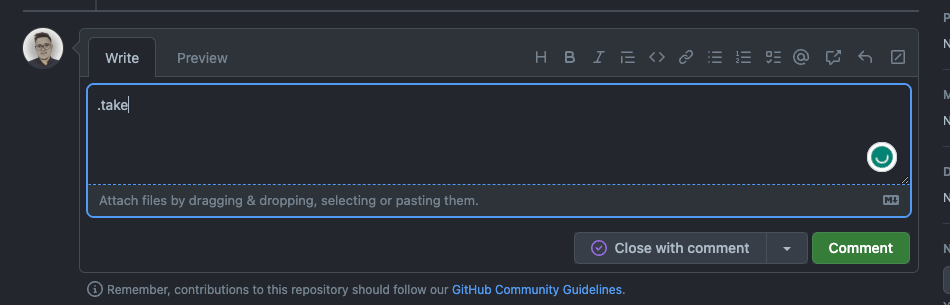

# Not Maintained! 
Check a better version here: [https://www.angular.courses/tools/library-health-check/explorer](https://www.angular.courses/tools/library-health-check/explorer) 

---

# [Angular Libraries Support](https://ngx-libs.com) ⛱️ [](https://app.netlify.com/sites/ngx-libs/deploys)


While ng updating Angular projects, it is important to know if a library has added support for the new Angular version. This project is supposed to solve this problem by providing a list of libraries and their support for different Angular versions.

## How to use

Filter the list by Angular version or library name. Click on the links to get to the library's repository, release page or npm page.

## How to contribute

## Take the issue

If you want to take one issue, feel free to use `.take` in the issue comment  


### Automatic

To add a **new** library, run the following command:

```shell
npm run add-lib
```

> Please leave feedback so we can improve the generator

To edit an **existing** library, please refer to [Manual](#manual)

### Manual

If you want to add a library, please create a pull request with the following changes:

- Add the library to the `/src/assets/library-support-data.json` file

## How to run locally

- Clone the repository
- Run `npm install`
- Run `npm start`

## License

MIT
