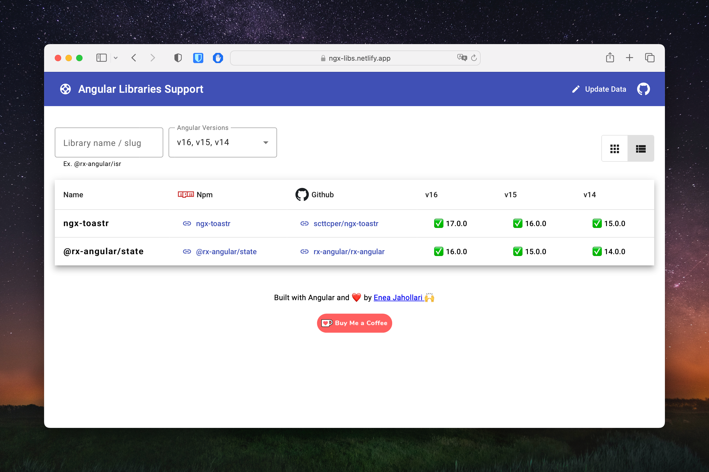

# [Angular Libraries Support](https://ngx-libs.netlify.app/) ⛱️

While ng updating Angular projects, it is important to know if a library has added support for the new Angular version. This project is supposed to solve this problem by providing a list of libraries and their support for different Angular versions.

## How to use
Filter the list by Angular version or library name. Click on the links to get to the library's repository, release page or npm page.

## How to contribute
If you want to add a library, please create a pull request with the following changes:
- Add the library to the `libs.data.ts` file

## How to run locally
- Clone the repository
- Run `npm install`
- Run `npm start`